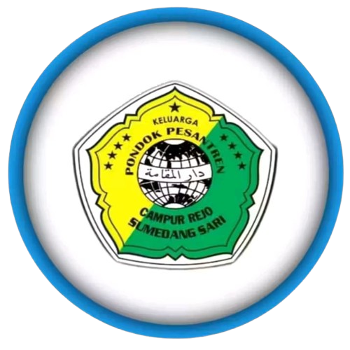

# pondok-pesantren-darul-muqomah
<!DOCTYPE html>
<html lang="id">
<head>
  <meta charset="UTF-8" />
  <meta name="viewport" content="width=device-width, initial-scale=1" />
  <meta name="description" content="Website resmi Pondok Pesantren Darul Muqomah Sumedang Sari. Pelajari visi, misi, peraturan, dan kegiatan kami." />
  <meta name="keywords" content="Pondok Pesantren, Darul Muqomah, Pesantren Qurani, OKU Timur, Sumedang Sari">
  <meta name="author" content="Pondok Pesantren Darul Muqomah Sumedang Sari">
  <title>Pondok Pesantren Darul Muqomah Sumedang Sari | Pesantren Qur’ani Berprestasi</title>

  
</head>

<body>

<header>
  
  <h1>PONDOK PESANTREN DARUL MUQOMAH</h1>
  <h1>دَارُ الْمُقَامَةِ سُومِيدَانْغ سَارِي</h1>
</header>

<nav>
  <button id="menu-toggle">☰</button>
  <ul id="nav-list">
    <li><a href="#beranda">Beranda</a></li>
    <li><a href="#prestasi">Prestasi</a></li>
    <li><a href="#kegiatan">Kegiatan</a></li>
    <li><a href="e:\projeck web\ppdm\galeri pondok pesantren daarul muqomah.png">Galeri</a></li>
    <li><a href="#pendaftaran">Pendaftaran</a></li>
    <li><a href="https://ppdarulmuqomah.blogspot.com/">Profil Pondok</a></li>
    <li><a href="#visi-misi">Visi Misi</a></li>
  </ul>
</nav>

  <h2>KEGIATAN PONDOK PESANTREN DARUL MUQOMAH DI ACARA 17 AGUSTUS</h2>
  <video controls poster="poster.jpg">
    <source src="vidio.mp4" type="video/mp4">
    Browser Anda tidak mendukung pemutaran video.
  </video>

  <h2>Visi</h2>
  
“Membentuk Pribadi Qur’ani, Berprestasi, Berakhlakul Karimah, Bersosial Tinggi, Serta Berkhidmah Kepada Agama, Nusa Bangsa dan Bernilaikan Aswaja (Ahli Sunah Waljamaah).”

  <h2>Misi</h2>
  <ul class="misi-list">
    <li>Menyelenggarakan Program Kegiatan Berbasis Pembelajaran Al-Qur’an.</li>
    <li>Mempersiapkan Generasi Qur’ani yang Memiliki Pemahaman Mendalam Tentang Al-Qur’an dan Mampu Mengaplikasikannya dalam Kehidupan Sehari-hari.</li>
    <li>Membangun Kepribadian Santri dengan Menanamkan Dasar Aqidah, Kesadaran Kepribadian, dan Bersosial Tinggi.</li>
    <li>Menumbuhkan Sifat Toleransi, Jiwa Ukhuwah, serta Tanggung Jawab dan Semangat Kemandirian.</li>
    <li>Menyiapkan Kader Santri yang Ikhlas, Terampil, dan Memiliki Ghiroh Islamiyah Berdasarkan Aswaja, Memiliki Etos Juang yang Tinggi, serta Mampu Berperan Aktif Sebagai Perekat Umat dengan Semangat Cinta Tanah Air dan Almamater.</li>
  </ul>

  <h2 style="text-align:center; color:#004d40;">📝 Pendaftaran Santri Baru</h2>
  

    Silakan isi formulir di bawah ini untuk mendaftar sebagai santri Pondok Pesantren <strong>Darul Muqomah Sumedang Sari</strong>.
    Setelah diisi, tekan tombol <b>Kirim ke WhatsApp</b> untuk mengirim data ke admin.
  

  <form id="formPendaftaran" style="max-width:650px; margin:40px auto; text-align:left;">
    <label>Nama Lengkap:</label> 
    <input type="text" id="nama" required placeholder="Masukkan nama lengkap" class="form-input"> 

    <label>Jenis Kelamin:</label> 
    <select id="jk" required class="form-input">
      <option value="">Pilih Jenis Kelamin</option>
      <option value="Laki-laki">Laki-laki</option>
      <option value="Perempuan">Perempuan</option>
    </select> 

    <label>Tempat, Tanggal Lahir:</label> 
    <input type="text" id="ttl" required placeholder="Contoh: Sumedang, 10 Mei 2010" class="form-input"> 

    <label>Alamat Lengkap:</label> 
    <textarea id="alamat" required placeholder="Masukkan alamat lengkap" rows="3" class="form-input"></textarea> 

    <label>Asal Sekolah:</label> 
    <input type="text" id="sekolah" required placeholder="Masukkan asal sekolah" class="form-input"> 

    <label>Nomor HP/WhatsApp Orang Tua:</label> 
    <input type="tel" id="wa" required placeholder="Contoh: 082279671805" class="form-input"> 

    <button type="button" onclick="kirimWA()" class="form-btn">📩 Kirim ke WhatsApp Admin</button>
  </form>

<!-- Back to Top & WhatsApp Float -->
<a href="#beranda" class="back-to-top">↑</a>
<a href="https://wa.me/6282279671805" target="_blank" class="whatsapp-float">📱</a>

<footer>
  

    
Jl. Lintas Sumedang Sari, Buay Madang Timur, OKU Timur 32161

    
Telepon: 085783172412

    
WhatsApp: <a href="https://wa.me/6282279671805" target="_blank">+6282279671805 (Admin)</a>

    
Email: <a href="mailto:darulmuqomah@gmail.com">darulmuqomah@gmail.com</a>

    

      
      
      
      
    

  

</footer>

</body>
</html>